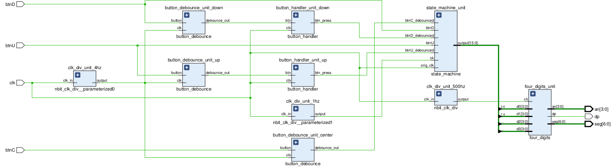

# CE339 Assignment 1

## Directory Structure
- [src](./src/) - Contains all source files for the design
- [tb](./tb/) - Relevant test benches for unit testing
- [Basys3_Master.xdc](./Basys3_Master.xdc) - Edited constraints file for the project
- [images](./images) - Images for this README file

## Design Overview

- For the inputs we have:
    - clk - 100MHz master clock
    - btnU/btnD - Up and down buttons on the Basys3 board to increment and decrement the timer
    - btnC - The centre button to start or pause the timer
- For the outputs:
    - an[3:0] - The 7-segment display anodes on the Basys3
    - dp - To turn on and off the decimal points on the 7-segment display
    - seg[6:0] - The cathodes of the 7-segment display
- There are 3 clock divider modules instantiated to generate clock frequencies of 1Hz, 4Hz and 500Hz. The 1Hz clock is used to decrement the timer in the GO state (when the timer is running), the 4Hz clock is used to debounce the button presses for reliability and the 500Hz clock is used to multiplex the 7-segment display. The clock divider uses a counter internally to divide the clock and is also a configurable and re-usable component, and the duty cycle can also be controlled
- There are two button handlers instantiated for the up and down buttons. This uses the debounced button and generates a continuous pulse if a button is pressed. This allows us to hold the button to generate a continuous pulse to increment the timer in the set state, vastly improving user experience.
- The state machine unit contains the BCD counters and implements the control logic as well as the state machine for the system. It takes input the clock, ad the buttons and outputs the two BCD counter outputs. The state machine has only 2 states, 'SET' and 'GO', and this module implements the logic for these two states to complete the timer.
- Finally, the four digits units takes the output of the state machine (i.e., the BCD counters) and displays the values on the 7-segment displays by using time division multiplexing clocked at 500Hz.

## Compiling the project

- Create a new project in Vivado
- Select all files `.vhd` from the [src](./src) folder as the design sources
- Select [Basys3_Master.xdc](./Basys3_Master.xdc) as the constraints file
- Synthesise, Implement and Generate Bitstream using Vivado
- Enjoy!